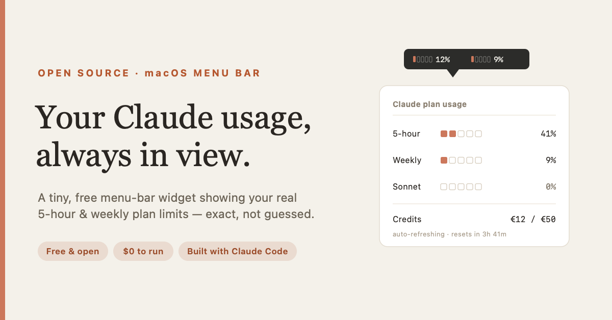

# Claude Usage Bar



A tiny macOS **menu-bar widget** that shows your **real Claude plan usage** — the same numbers as Claude Code's `/usage` panel — at a glance.

It reads your Claude Code login from the macOS Keychain and calls Claude's own usage endpoint, so the numbers are exact (not estimated). Two little segment meters sit in your menu bar:

```
▰▱▱▱▱ 12%   ▰▱▱▱▱ 9%        ← 5-hour window  ·  weekly (all models)
```

Click it for the full breakdown: **5-hour**, **weekly (all models)**, **weekly (Sonnet)**, and **extra credits**, each with a reset countdown.

> _Add a screenshot here — generate one with `ClaudeUsage --preview` (see below)._

---

## Why

Claude subscriptions have rolling usage limits (a 5-hour window and a weekly limit). The numbers exist in Claude Code's `/usage` command, but you have to stop and run it. This puts them in your menu bar, always visible, refreshing themselves — like a battery indicator for your Claude plan.

- **Exact, not estimated** — reads Claude's own usage endpoint.
- **No cost** — it calls a read-only stats endpoint; no model runs, no tokens are spent, and it does **not** consume your limits or credits.
- **Self-refreshing** — renews its own access token the way Claude Code does, so it just keeps working.
- **Native & tiny** — a single Swift file, no dependencies, no Dock icon.

---

## Requirements

- **macOS 13 or newer** (Apple Silicon or Intel).
- **[Claude Code](https://claude.com/claude-code)** installed and signed in with a Claude subscription (Pro/Max). The widget reads its login token. _(If you only use API/console billing, the subscription usage endpoint won't have data for you.)_
- **Xcode Command Line Tools** (for the Swift compiler): `xcode-select --install`.

---

## Install

### Option A — double-click installer (easiest)

Download **`install-claude-usage.command`**, then **right-click it → Open → Open** (the right-click is needed once because it's unsigned). It checks for the compiler, builds the app to `~/Applications/ClaudeUsage.app`, and launches it.

### Option B — clone & build

```bash
git clone https://github.com/andisava84-ship-it/macoswidget.git
cd macoswidget
./build.sh
open ~/Applications/ClaudeUsage.app
```

### Option C — let Claude Code build it

Open this repo in [Claude Code](https://claude.com/claude-code) and ask it to *"build and run the widget per the README,"* or paste this README in and let it run `./build.sh`. (Meta, but it works.)

### First run

- A **Keychain prompt** appears — *"…wants to use the 'Claude Code-credentials' key…"*. Click **Always Allow**.
- The widget appears at the top-right of your menu bar. Click it → **Launch at login** to keep it running after restarts.
- If it shows **`login`**, your Claude Code session expired — run `claude`, type `/login`, then click **Refresh now**.

### See it before you commit

```bash
~/Applications/ClaudeUsage.app/Contents/MacOS/ClaudeUsage --preview   # renders the icon at several levels → opens a PNG
~/Applications/ClaudeUsage.app/Contents/MacOS/ClaudeUsage --once      # prints the numbers as text
```

---

## How it works

1. Reads the Claude Code OAuth token from the macOS Keychain item `Claude Code-credentials` (via `/usr/bin/security`).
2. If the access token is expired, refreshes it against `https://platform.claude.com/v1/oauth/token` using Claude Code's public OAuth client ID, and writes the rotated token back to the Keychain **only on success** (a failed refresh can never corrupt your login).
3. Calls `GET https://api.anthropic.com/api/oauth/usage` and renders the result.
4. Polls every 2 minutes, on menu open, and on **Refresh now**.

### Privacy & security

- Your token **never leaves your machine** except in the request to Anthropic's own servers (`api.anthropic.com` / `platform.claude.com`) — exactly what Claude Code itself does.
- Nothing is stored anywhere outside your Mac. There is no telemetry, no third-party network calls.
- The app is built locally and ad-hoc signed; you can read every line in [`Sources/main.swift`](Sources/main.swift) (~350 lines, one file).

---

## Customize

Everything is in [`Sources/main.swift`](Sources/main.swift); edit and re-run `./build.sh`:

- **Refresh interval** — `Timer.scheduledTimer(withTimeInterval: 120, …)`.
- **Colors** — `gaugeColor(_:)` (Claude clay → rust → dark rust-red by load).
- **Segments / layout** — `dualBarImage(…)`.

---

## Caveats

- **Unofficial.** This is a community tool, **not affiliated with or endorsed by Anthropic**. It uses the same private endpoint Claude Code's `/usage` reads; if Anthropic changes it, the widget will show `—` until updated.
- **macOS only.**
- Requires a Claude **subscription** login through Claude Code (the OAuth flow), not an API key.

---

## Uninstall

```bash
osascript -e 'quit app "ClaudeUsage"' 2>/dev/null
rm -rf ~/Applications/ClaudeUsage.app
rm -f ~/Library/LaunchAgents/com.claudeusagebar.plist
```
Optionally remove the "Always Allow" entry for `Claude Code-credentials` in **Keychain Access**.

---

## Contributing

Issues and PRs welcome. It's intentionally one small Swift file — keep it simple.

## License

MIT — see [LICENSE](LICENSE).
